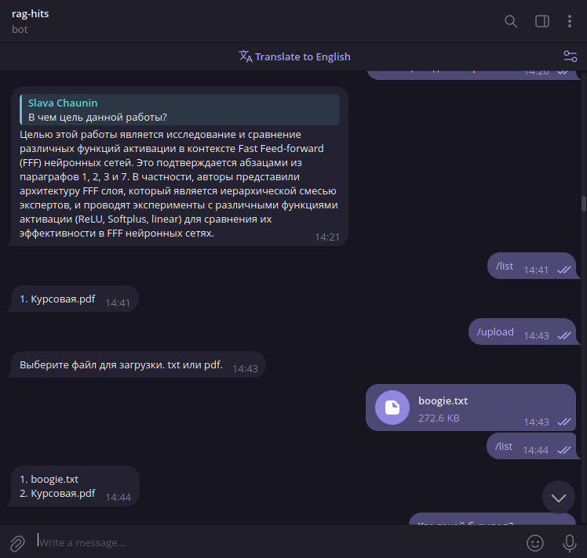

# tg-rag
A small telegram bot with retrieval augmented generation (RAG). Laboratory work for the course at HITs.
- You can add your documents to the database. (pdf and txt are supported)
- The search is performed on all uploaded documents.
- You can switch between two databases: ElasticSearch and Qdrant.
- You can choose any LLM that has OpenAI API and sentence transformer model for embeddings.



## Installation
Use pip or other package manager to install the package from the git repository.
```sh
pip install git+https://github.com/ssslakter/tg-rag.git@v0.1.0
```
## Usage
You first need to create a telegram bot and get the token. You can follow the instructions [here](https://core.telegram.org/bots/tutorial#obtain-your-bot-token).

Then you can run the bot with the following command:
```sh
export BOT_TOKEN=<your_token> && rag_start
```
Here is a list of available options:
```txt
usage: rag_start [-h] [--db_name DB_NAME] [--only_text] [--embedding_model EMBEDDING_MODEL] [--api_url API_URL] [--model MODEL] [--v]

options:
  -h, --help                         show this help message and exit
  --db_name DB_NAME                  "Database to use: elastic or qdrant" (default: qdrant)
  --only_text                        "If True, only using full-text search" (default: False)
  --embedding_model EMBEDDING_MODEL  "Sentence transformer model to use. Unused if `only_text` is True" (default: cointegrated/rubert-tiny2)
  --api_url API_URL                  "URL of the LLM API" (default: http://localhost:11434)
  --model MODEL                      "Model to use for LLM" (default: llama3)
  --v                                "Verbose mode" (default: False)
```
